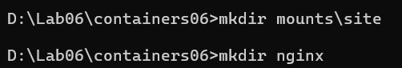
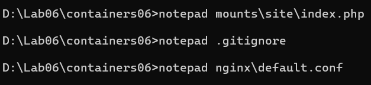
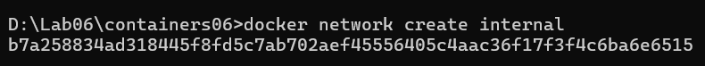

# Laborator: Containere Docker pentru Aplicație PHP

## Scopul lucrării

Scopul acestei lucrări este de a înțelege și gestiona interacțiunea între mai multe containere Docker, utilizând imagini pentru serverele nginx și php-fpm. La finalul lucrării, vei  fi capabil să creezi un mediu de execuție PHP cu două containere care interacționează între ele printr-o rețea Docker internă.

## Sarcina

Sarcina presupune crearea unei aplicații PHP care rulează pe două containere Docker:
- **Frontend:** containerul Nginx care servește aplicația web.
- **Backend:** containerul PHP-FPM care execută aplicația PHP.

## Descrierea efectuării lucrării

### 1. Crearea directorului și a structurii de fișiere
Primul pas este crearea directorului `mounts/site` în cadrul repository-ului `containers06` și copierea site-ului PHP creat în cadrul unui alt proiect (cursul Programare PHP) în acest director.

```bash
mkdir -p mounts/site
# Copiați fișierele site-ului PHP în directorul mounts/site
```


### 2. Crearea fișierului `.gitignore`
Creați fișierul `.gitignore` în rădăcina proiectului și adăugați următoarele linii pentru a ignora fișierele din directorul `mounts/site`.

```bash
# Fișierul .gitignore
mounts/site/*
```

### 3. Configurarea nginx
Creați fișierul `nginx/default.conf` cu următorul conținut:

```nginx
server {
    listen 80;
    server_name _;
    root /var/www/html;
    index index.php;
    location / {
        try_files $uri $uri/ /index.php?$args;
    }
    location ~ \.php$ {
        fastcgi_pass backend:9000;
        fastcgi_index index.php;
        fastcgi_param SCRIPT_FILENAME $document_root$fastcgi_script_name;
        include fastcgi_params;
    }
}
```



Acesta configurează serverul Nginx să răspundă la cereri HTTP și să proceseze fișiere PHP utilizând containerul PHP-FPM (backend).

### 4. Crearea rețelei Docker
Creați rețeaua `internal` pentru ca cele două containere (nginx și php-fpm) să poată comunica între ele.

```bash
docker network create internal
```


### 5. Crearea containerelor Docker
Creați și lansați containerele `backend` (PHP-FPM) și `frontend` (Nginx) utilizând următoarele comenzi Docker.

**Backend (PHP-FPM)**:

```bash
docker run -d --name backend --network internal -v $(pwd)/mounts/site:/var/www/html php:7.4-fpm
```

**Frontend (Nginx)**:

```bash
docker run -d --name frontend --network internal -v $(pwd)/mounts/site:/var/www/html -v $(pwd)/nginx/default.conf:/etc/nginx/conf.d/default.conf -p 80:80 nginx:1.23-alpine
```

Aceste comenzi vor porni containerele `backend` și `frontend`, fiecare montând directoarele necesare și configurându-le pentru a comunica prin rețeaua `internal`.

### 6. Testarea aplicației
Pentru a testa aplicația, deschideți browser-ul și accesați [http://localhost](http://localhost). Dacă site-ul afișează mesajul "Hello from PHP running in Docker!", atunci aplicația funcționează corect.

### 7. Crearea fișierului `index.php`
Fișierul `index.php` din directorul `mounts/site` va arăta un mesaj simplu pentru a confirma funcționarea corectă a aplicației PHP.

```php
<?php
echo "Hello from PHP running in Docker!";
?>
```

---

## Răspunsuri la întrebări

1. **În ce mod în acest exemplu containerele pot interacționa unul cu celălalt?**

   Containerele interacționează între ele prin intermediul rețelei `internal`. Acest lucru le permite să comunice direct, fără a fi expuse publicului sau internetului. Containerul `frontend` (Nginx) poate trimite cereri către containerul `backend` (PHP-FPM), care le procesează.

2. **Cum văd containerele unul pe celălalt în cadrul rețelei internal?**

   În cadrul rețelei Docker `internal`, containerele pot să se vadă prin numele lor (de exemplu, `frontend` și `backend`). De exemplu, în configurația Nginx, este specificat `fastcgi_pass backend:9000`, ceea ce înseamnă că serverul Nginx trimite cererile către containerul `backend` pe portul 9000.

3. **De ce a fost necesar să se suprascrie configurarea nginx?**

   A fost necesar să se suprascrie configurarea Nginx pentru a direcționa cererile PHP către serverul PHP-FPM din containerul `backend`. Configurația implicită a Nginx nu este configurată pentru a lucra cu PHP, iar personalizarea fișierului `default.conf` asigură corecta procesare a fișierelor PHP.

---

## Concluzii

Această lucrare demonstrează cum două containere Docker pot interacționa într-un mediu de rețea intern, cu un container Nginx care servește aplicația PHP și un container PHP-FPM care procesează fișierele PHP. Prin crearea unui fișier de configurare personalizat pentru Nginx și utilizarea rețelei interne Docker, aplicația poate funcționa corect într-un mediu izolat și eficient.
